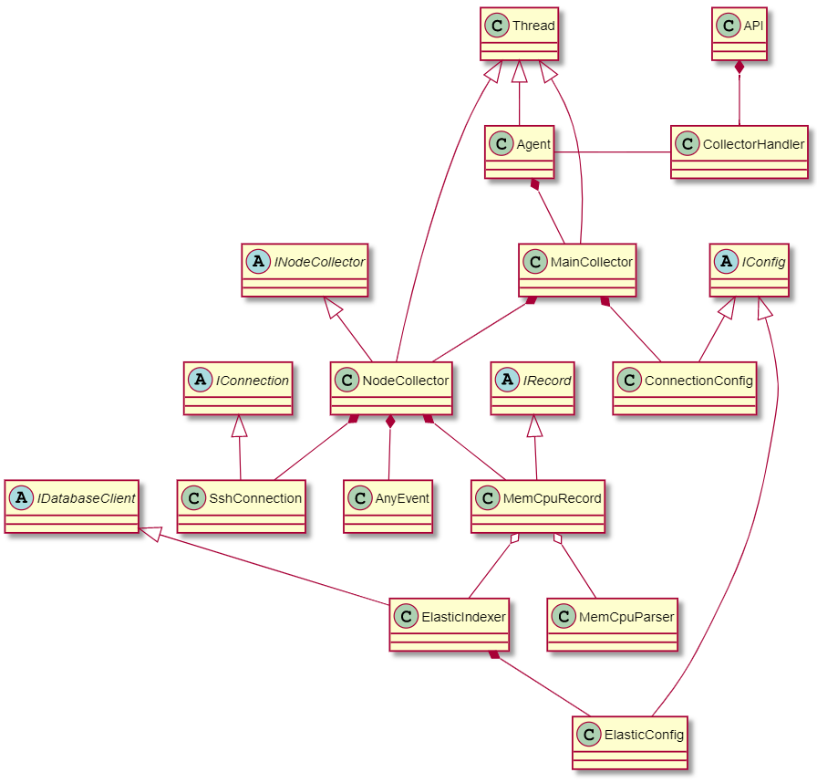

# Overview

Datacollector is a Python 3-based application created for collecting data from one or multiple target devices. 
The reference implementation of Datacollector provides functionality to collect memory and CPU data over SSH from 
a remote Linux OS based device.

Datacollector provides a framework for collecting data from one or multiple target devices, referred to as nodes, with 
specified collection intervals and durations. It does not restrict the type of data or the means of collecting the data,
therefore, they can be implemented as needed.

## Class architecture

The following diagram depicts the class architecture of the reference implementation of Datacollector:

The architecture of Datacollector consists of the following main parts: API - Agent - Maincollector - Nodecollector.

### API

The provided implementation of the API can be utilized to start and stop Datacollector. The implementation targets 
the Agent, and is used to start and stop the whole instance of Datacollector including Agent, Maincollector and 
Nodecollector(s).

### Agent

Agent routes external messages to the actual collector. In the reference implementation, function calls from API or 
``run.py``-command line script target the Agent, which controls the start and stop functions of Maincollector.
Although not implemented, a single Agent can handle multiple Maincollectors.

### Maincollector

Maincollector creates Nodecollectors and handles start, collect and stop events of Nodecollectors. It listens to messages
from the Agent and acts accordingly.

### Nodecollector

In Datacollector, Nodecollector is the actual collector unit. The class is depicted as an abstract 
*INodeCollector*-class, which provides all the necessary functionalities apart from actual collection methods. 
In the reference implementation, the class is implemented as *MemCpuNodeCollector*. 
Nodecollectors perform the implemented collection functions and call data ingestion methods implemented in a subclass 
instantiation of *IRecord*-class.
A single instance of Maincollector can create and handle multiple Nodecollectors.

## Other classes

Alongside the aforementioned classes, Datacollector utilizes various other classes to add necessary additional 
functionality. These classes are mainly represented as abstract classes, and the reference implementation of 
Datacollector utilizes subclass implementations of these abstract classes.

### IConnection

*IConnection* is an abstract class for implementing functionalities needed for connection between the NodeCollectors 
and target devices. In the reference implementation, *SshConnection* is an implementation of the abstract class, and 
provides functionalities for establishing connection via SSH.
When creating a *NodeCollector*, an instantiation of a class implementation  of *IConnection* is required. The object 
constructor requires configuration parameters as arguments, which can be read and provided via *IConfig* implementation 
(see *IConfig*).

### IConfig

*IConfig* is an abstract class that provides functionalities for reading configurations from config-files. It 
utilizes Python standard library configparser. 
In the reference implementation, implementations of *IConfig* are utilized to read configurations for SSH-connection 
(*ConnectionConfig*) and for Elasticsearch client (*ElasticConfig*). See [Configuration-page]() for more details.
Creating a Nodecollector requires an object of *IConnection*-class implementation, e.g. *SshConnection*, as a parameter.
In turn, the object of *IConnection*-class implementation requires configuration parameters as constructor arguments. 

### IRecord

*IRecord* provides functionalities for ingesting the collected data. In the reference implementation, the class 
implementation *MemCpuRecord* includes methods to save the data into JSON-files. Additionally, the functionality to 
index the data into Elasticsearch is accessed via *MemCpuRecord*. The actual indexing is handled by *ElasticIndexer*.

### IDatabaseClient

*IDatabaseClient* provides a template to implement a database client. In the reference implementation, an implementation
is available in *ElasticIndexer*. *ElasticIndexer* initialises the client with the config parameters read by 
*ElasticConfig*. 

*ElasticIndexer* utilizes a Python package [elasticsearch-py](https://github.com/elastic/elasticsearch-py).
For the development of Datacollector, elasticsearch-py version 
[7.7.1](https://github.com/elastic/elasticsearch-py/releases/tag/7.7.1) was utilized.

### MemCpuParser

*MemCpuParser* includes functionality for calculating CPU utilization from the collected data (see Wiki/Data collection).

## Logging

The logging is performed utilizing Python [logging](https://docs.python.org/3/library/logging.html)  -module. 
In the reference implementation of Datacollector, the following are logged:

#### Console

The implementation includes outputting logs of ``level.INFO, level.WARNING, level.ERROR`` to the console.

#### Log files

The implementation includes outputting logs of ``level.WARNING, level.ERROR`` to log-files. The logging is 
agent-specific, but can be reimplemented as needed.

